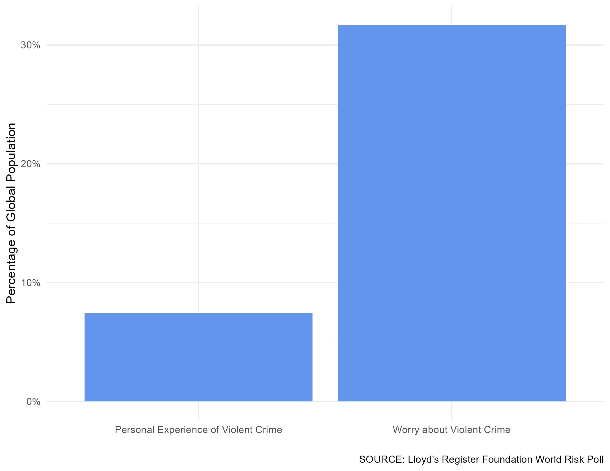

# Summary

Effective and efficient decision-making depends on the accurate assessment of risk. Despite this, it is well established that humans struggle to assess risk accurately [@kahneman2011thinking]. The gap between perceived and actual levels of risk are important to understand, as biases can lead to poor decision-making, which can adversely impact individual and collective wellbeing. The World Risk Poll, designed by the Lloyd's Register Foundation, is a global survey of perceptions of risk and experiences of harm that can be used to explore the relationships between the two. The Poll has been carried out by Gallup in 2019 and 2021 as part of the Gallup World Poll, with additional surveys planned for 2023 and 2025. It draws on interview responses from over 125,000 people in more than 120 countries. This paper demonstrates how the new R package `worldriskpollr` provides easy access to aggregated and disaggregated forms of the World Risk Poll data based on geography and the demographic characteristics of respondents.
  

# Statement of need

In a time of rising uncertainty, it is important to understand perceptions of safety across different regions, countries and demographic groups, and to examine how different risks relate to each other and to global events. The World Risk Poll data provides researchers, policy-makers and the general public with a powerful lens through which to see the different types and degrees of risk faced by people around the world, as well as how perceptions and attitudes about risk are informed by geography and social circumstances. We have designed the `worldriskpollr` package to enable easy access to aggregated and disaggregated forms of the World Risk Poll data. In this article, we provide an explanation of the functionality of the package as well as an example application of it drawn from the 2023 Safety Perceptions Index [@spi2023].


# Functionality

The `worldriskpollr` package is designed to provide easy and interactive access to the aggregated and disaggregated survey data collected through the World Risk Poll. Using the following functions, users can download and process the World Risk Poll data into their package cache memory, then extract questions of interest.

To search for a question of interest, `worldriskpollr` provides `wrp_search` for users to enter search terms. If the search term is a match, `wrp_search` will return a dataframe with the following columns.

-   `wrp_question_uid`: the unique identifier for the question (needed to use the function `wrp_get`)

-   `question`: the full name of the question, as coded in the Poll

-   `responses`: all the possible responses recorded in the Poll (e.g. "Yes"", "No", "Very Worried", etc.)

The following line of code returns a list of all the questions and possible responses to World Risk Poll questions containing the word "violence".

```r
violence <- wrp_search("violence")
```

Users can then make use of the `wrp_get` function to access aggregated data based on geographic units -- that is, individual countries or groupings of countries. Users select one of four geographic units they would like to analyse. From there, they can add a specification using nine disaggregation options (including "No disaggregation") to produce a dataframe based on different demographic categories of survey respondents.

-   **Aggregations based on *geographic units*:**

    -   `country`

    -   `region`: 15 regional groups

    -   `income`: four groups of countries by country-income level

    -   `world`: all surveyed countries

-   **Disaggregations based on *demographic characteristics*:** results can then be assessed based on the following groups (which are listed with integers from 0 to 9):

    -   0: `No disaggregation`: response rates from the whole geographic unit

    -   1: `Age group`: response rates across four age brackets

    -   2: `Sex`: response rates by male and female respondents

    -   3: `Education`: response rates by three educational attainment levels

    -   4: `Income feelings`: response rates by the perceived sufficiency of current household income

    -   5: `Household income`: response rates based on five income brackets

    -   6: `Employment`: response rates based on five possible employment statuses

    -   7: `Urban/rural`: response rates based on the type of setting respondents live in

    -   8: `Household size`: response rates based on the number of people in the household - five groupings

    -   9: `Children in household`: response rates based on the number of children under 15 in the household - six groupings

The following lines of code return a dataframe showing the country-level response rates to "VH1", a World Risk Poll question asking if respondents have ever had an experience of violence or harassment in the workplace. Further, it specifies that the results should not be disaggregated by any demographic marker. This dataframe includes with six columns: `geography`, `disaggregation`, `group`, `year`, `question`, `response`, and `percentage`.

```r
work_violence <- wrp_get(geography = "country", 
                         wrp_question_uid = "VH1", disaggregation = 0)
```             

As such, a standard use case stringing of `wrp_search` and `wrp_get` together could look like this:

```r
# Search for a topic
tmp <- wrp_search("violence")
# Pick the question of interest
tmp <- tmp[tmp$question ==
  "Ever Experienced Physical Violence/Harassment at Work (all countries)", ]
# Get the question code
tmp <- unique(tmp$wrp_question_uid)
# get the data
tmp <- wrp_get(geography = "country", 
               wrp_question_uid = tmp, disaggregation = 0)
```

# Example Application: Worry and Experience of Risk

The World Risk Poll allows users to compare levels of worry about a risk with levels of first- and second-hand experience with that risk. This is particularly interesting in the current media context. The following example is one of the key findings in the 2023 Safety Perceptions Index [@spi2023].

> The news media has long been critiqued for giving outsized focus to comparatively rare occurrences, particularly violent crime, which serves to inflate perceptions of the danger of such threats [@Altheide2018]. Recent analyses have demonstrated that this dynamic is particularly pronounced with social media. A study from Finland revealed that, while habitual consumers of traditional news media were five per cent more likely than non-consumers to report a fear of violent crime, those regularly consuming both traditional and social news media were ten per cent more likely to be fearful. Moreover, those consuming a combination of traditional, social, and alternative information sources (the latter including disreputable or unreliable sources) were 16 per cent more likely to report fearfulness of violent crime [@Nsi2020]. In contrast, other types of harm, such as those related to mental health and the workplace, tend to receive less media coverage, while also being associated with higher degrees of perceived controllability [@Barnetson2015].

To compare levels of worry and experience of a specific risk in the World Risk Poll, users can first search questions around a theme. In this paper, the authors have selected "violent crime". The following line of code returns a dataframe with World Risk Poll questions containing the term "violent crime".

```r
# Search for questions around violent crime
violent_crime <- wrp_search("violent crime")
```

The resulting dataframe shows two particularly relevant questions for comparing rates of worry and experience related to violent crime. Each one is associated with one or more possible responses that are useful for assessing acute worry and personal experience:

-   **Q4C: Worried Violent Crime Could Cause Serious Harm** - to compare worry vs experience, the analysis will focus on the proportion of respondents answering "Very worried".

-   **Q5C: Experienced Harm in Past Two Years: Violent Crime** - to compare worry vs experience, the analysis will sum the proportion of respondents answering "Yes, personally experienced" and "Both" (with "Both" referring to both personal experience and knowing someone else who has experienced it).

The following example aggregates these statistics at the global level, in the following way:

```r
# Retrieve globally aggregated data on levels of worry of violent crime
worry <- wrp_get(geography = "world", 
                 wrp_question_uid = "Q4C", disaggregation = 0) %>%
  filter(response == "Very worried") %>%
  group_by(geography, year, question) %>% 
  summarise(percentage = sum(percentage)) %>%
  ungroup() %>%
  mutate(short_question = "Worry about Violent Crime")
  
# Retrieve globally aggregated data on levels of experience on violent crime
personal_experience <- wrp_get(geography = "world", 
                      wrp_question_uid = "Q5C",
                      disaggregation = 0) %>%
  filter(response %in% c("Yes, personally experienced",
                         "Both")) %>%
  group_by(geography, year, question) %>% 
  summarise(percentage = sum(percentage)) %>%
  ungroup() %>%
  mutate(short_question = "Personal Experience of Violent Crime")
           
```

From these dataframes, it can be seen that Q4C was asked in both 2019 and 2021. However, question Q5C only returns results for 2021. To make the two comparable, we can filter by year, so that the results match in the two dataframes. We can then combine them into a single dataframe. 

```r
# Make dataframes include the same years
worry <- worry %>% filter(year %in% personal_experience$year)
# Combine dataframes for plotting
worry_personal_experience <- worry %>% rbind(personal_experience)       
```

After this, the following code can be used to plot the response rates to these two questions, as shown in the figure below, we find that the number of people who worry greatly about violent crime is more than four times higher than the number who have recently experienced it first hand.

```r
p=ggplot(worry_personal_experience, aes(x = short_question, y = percentage/100)) + 
  geom_bar(stat = "identity", fill = "cornflowerblue") + 
  theme_minimal() +
  labs(x = "", 
       y = "Percentage of Global Population", 
       caption = "SOURCE: Lloyd's Register Foundation World Risk Poll") +
  scale_y_continuous(labels = scales::percent)
print(p)
```


# Acknowledgments

The authors acknowledge the support of the Lloyd's Register Foundation in the development of this article, which forms part of a multi-year collaboration between the Foundation and the Institute for Economics and Peace. We also wish to acknowledge Thomas Morgan for developing the index framework for the first Safety Perceptions Index, which was released in 2022.


# References
